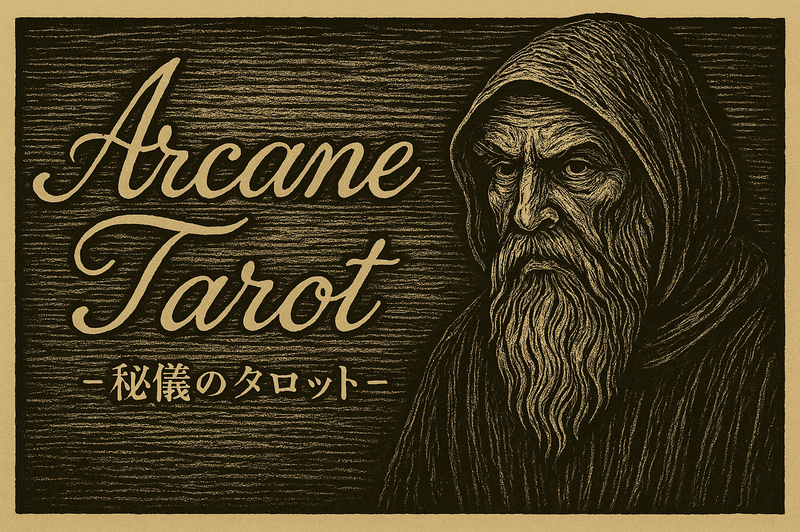

タロット占い（Electron アプリ）
==============================

Electron 製のタロット占いアプリです。三枚引き（過去・現在・未来）とワンオラクルに対応しています。

主な機能
--------
- 起動時にスタートメニュー（オーバーレイ）を表示
- 三枚引き / ワンオラクルを選択して占い開始
- 各カードの位置ラベル（過去/現在/未来）を表示
- 右下にアクション（スタートメニュー / もう一度 / AIアドバイス）
- 設定モーダル（OpenAI API Key / Model）とスタブ動作の併用
- メニューバーは「メニュー」（スタート/設定/終了）の最小構成

セットアップ / 起動
------------------
- 依存のインストール: `npm install`
- 起動: `npm start`
- 操作:
  - 起動するとスタートメニューが表示されます
  - 「三枚引きを始める」/「ワンオラクルを始める」から選択
  - カードをめくると（正位置/逆位置を含めて）内容が表示されます
  - 全カード（または1枚）が出揃うと右下にアクションが出ます
  - 「スタートメニュー」で最初の画面に戻る / 「もう一度」でやり直し
  - 「AIアドバイス」で要約とアドバイスを生成（API未設定時はスタブ）

修正履歴（要約）
----------------
- 2025-09-30
  - メニューバーを刷新し「メニュー」配下に「スタート/設定/終了」を配置
  - スタートメニューを開く IPC（`menu:start`）を追加しレンダラと連携
  - メニューバー直下に出る灰色の細線を CSS で抑止
- 2025-09-29
  - AdviserService を導入し `window.adviser.generate()` を統一的に提供
  - 設定モーダル（API Key/Model）とショートカット（Ctrl+, / Cmd+,）を追加
  - Electron 環境で prompt 非依存の入力に変更し、スタブ/OpenAI 両対応
- 2025-09-28
  - スタートメニュー（オーバーレイ）と右下アクション UI を整理
  - 表示/アニメーション/速度の調整、カード情報の表示改善
- 2025-09-17
  - 画面内ヘッダ整理、スタートメニュー経由のフローへ移行

今後の改善点（2025-09-30 メモより）
-----------------------------------
- メニューバー直下の謎の細線の恒久対策（現状は CSS で覆い隠し）
- スタートメニューに「なにもしない/戻る」動線の追加
- 占うトピックの設定・聞き取りフロー（カードごと、または開始時）
- カードを自動で表にする機能、並べたカードを一気に確認できる機能
- トピック未入力時のバリデーション（空でも実行できてしまう対策）
- ギャラリーモードの追加（全カードの絵柄・正逆位置の意味を参照）
- 右下アクションの整理（UIとしての一貫性・わかりやすさ向上）
- ディレクトリ構造とデータの整理（命名・配置の統一）

主なファイル/ディレクトリ
--------------------------
- `main.js`: アプリウィンドウ作成・メニュー定義（メニュー/スタート/設定/終了）
- `preload.js`: IPC ブリッジ（`mode:change`/`start:run`/`menu:start`/`settings:open` など）
- `src/index.html`: 画面 DOM とスタートメニュー/アクション
- `src/styles.css`: レイアウト/アニメーション/CSS変数等（メニューバー下の細線抑止含む）
- `src/renderer.js`: スタートメニュー、占い進行、AIアドバイス、設定モーダルの制御
- `src/modes/`: モード実装（`shared.js`/`three-card.js`/`one-oracle.js`）
- `src/tarot-data.js`: カード定義
- `img/`: 背面画像/背景/カード画像

ライセンス
--------
本リポジトリに含まれるプログラムは Codex によって作成され、画像は ChatGPT によって生成されています。特記のない限り、プログラムおよび同梱画像を含む本ソフトウェア一式は MIT License の下で提供します。

再利用・再頒布に関する条件（MIT 準拠）
- 再利用・再頒布（ソース/バイナリ/派生物を含む）を行う場合は、著作権表示と本ライセンス（MIT License）の全文を必ず同梱してください。
- 著作権表示例: `Copyright (c) 2025 YoheiKunita`
- ライセンスの全文は同梱の `LICENSE` を参照してください。

